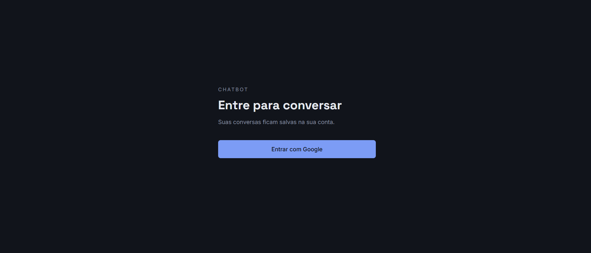
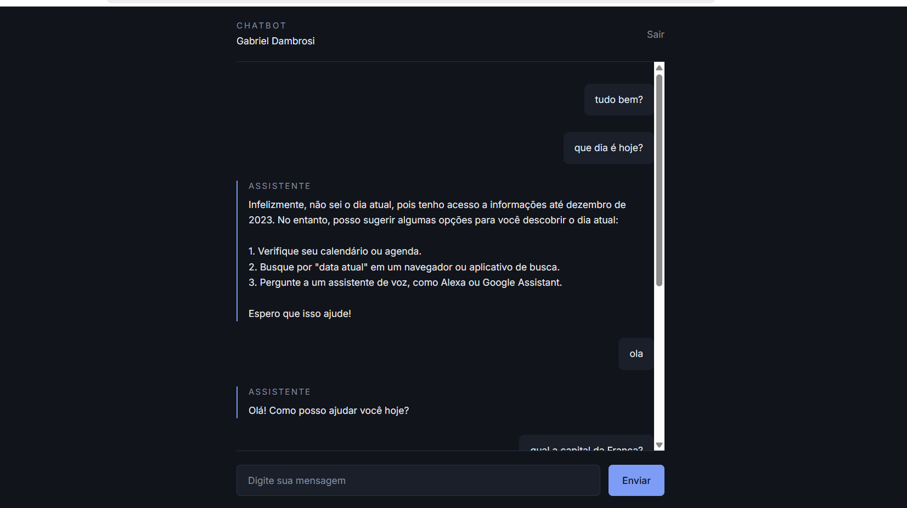

# Chatbot com IA e Login Google

Aplicação de chat com assistente de IA, autenticação via Google e histórico persistente por usuário.


## Telas





## Tecnologias

- **Laravel 13** — framework, com PHP 8.4
- **Livewire 4** — interface reativa sem JavaScript customizado
- **Laravel AI SDK** — camada unificada de acesso a provedores de IA
- **Ollama** — modelo local (llama3.2) em desenvolvimento
- **Tailwind CSS 4** — estilização
- **MySQL** — persistência
- **Pest** — testes automatizados
- **GitHub Actions** — integração contínua

## Funcionalidades

- Login e cadastro automático via Google OAuth (Laravel Socialite)
- Chat com respostas de IA em tempo real, sem recarregar a página
- Histórico de conversas persistido por usuário
- Memória de contexto: o assistente considera as mensagens anteriores
- Rotas protegidas por middleware de autenticação
- Logout com invalidação e regeneração de sessão

## Decisões técnicas

**Provedor de IA intercambiável.** O agente não conhece o provedor: a escolha vem da variável `AI_PROVIDER`. Em desenvolvimento usa Ollama local (custo zero); em produção, basta trocar a variável para usar OpenAI ou outro dos 16 provedores suportados, sem alterar código.

**Contexto limitado a 10 mensagens.** Modelos têm janela de contexto finita e cada mensagem consome tokens. O limite equilibra memória da conversa e custo por requisição.

**IA simulada nos testes.** A suíte usa `ChatAssistant::fake()` para não depender de serviço externo. Resultado: os testes rodam em menos de 1 segundo e funcionam no CI, que não tem Ollama instalado.

## Como rodar localmente

Requisitos: PHP 8.3+, Composer, Node 20+, MySQL e [Ollama](https://ollama.com).

```bash
git clone https://github.com/thedambrosi/chatbot-laravel.git
cd chatbot-laravel

composer install
npm install

cp .env.example .env
php artisan key:generate
```

Configure no `.env` as credenciais do banco e do Google OAuth. Depois:

```bash
php artisan migrate
ollama pull llama3.2

npm run dev
php artisan serve
```

A aplicação fica disponível em `http://localhost:8000`.

## Testes

```bash
php vendor/bin/pest
```

## Licença

MIT
